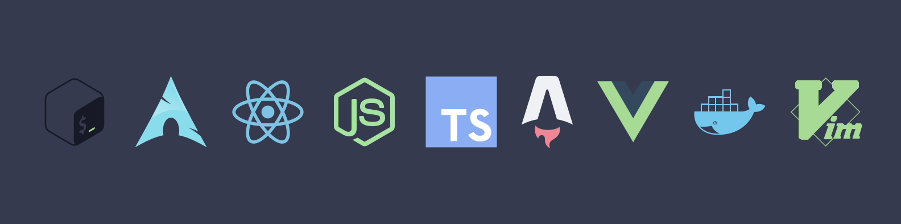

  <h3>Hello there :wave:</h3>

  

  I am currently a front & back-end web developer living in Strasbourg, France. I love to discover new technologies (and the JS ecosystem changes every 2 minutes, so that's nice I guess 🙃). I also repair printers for my family as all developers do obviously, and I game on my free time.

  On a more serious note, if you would like to know me more, check out my website: <https://www.sutter-nicolas.com/>

  

    
    
  

---

### My awesome stats 📊

  

  

> Keep in mind that these stats can only gather data from my public repositories and therefore, do not represent my actual experience (or my countless private repos 😅)

---

### My best repos (I think so anyway) ✨

---

### My tech stack & stuff 🤓

---

### My personal conventions 📏

#### Git 🌳

- I recently adopted [Conventional Commits](https://www.conventionalcommits.org/en/v1.0.0/) and I love it.

#### Code quality & formatting 🎨

- I use [eslint](https://eslint.org/) for most code quality checks (and some formatting)
- I use [prettier](https://prettier.io/) for formatting
- When I can, new code always comes in a PR (or MR on GitLab)

---

### Unrelated: top 3 of my favorite cheeses 🧀

1. [Morbier](https://fr.wikipedia.org/wiki/Morbier_(Jura))
2. [Raclette](https://fr.wikipedia.org/wiki/Raclette)
3. [Reblochon](https://fr.wikipedia.org/wiki/Reblochon)

> I use Arch btw
